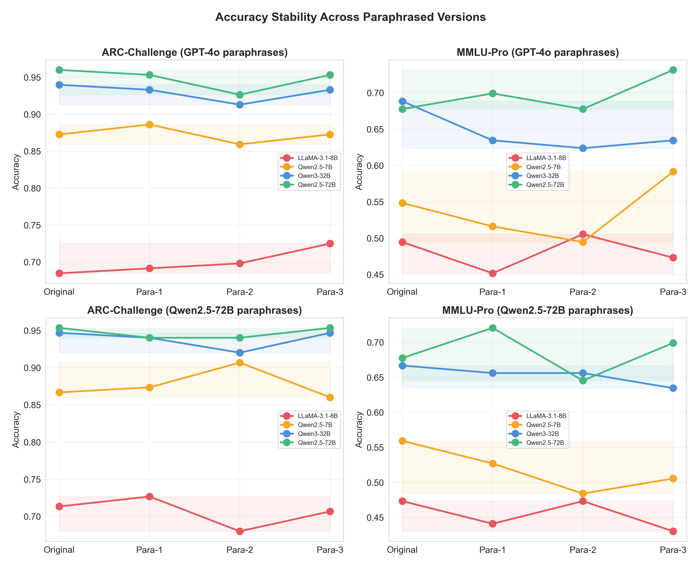
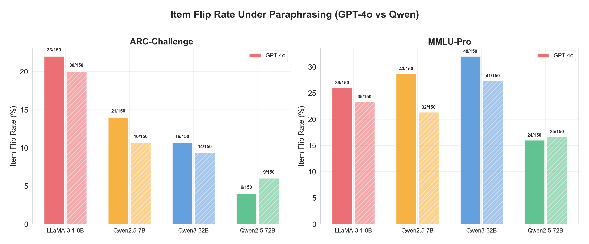
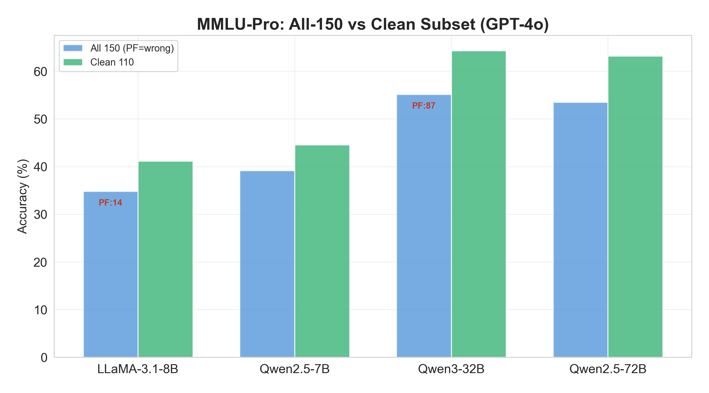
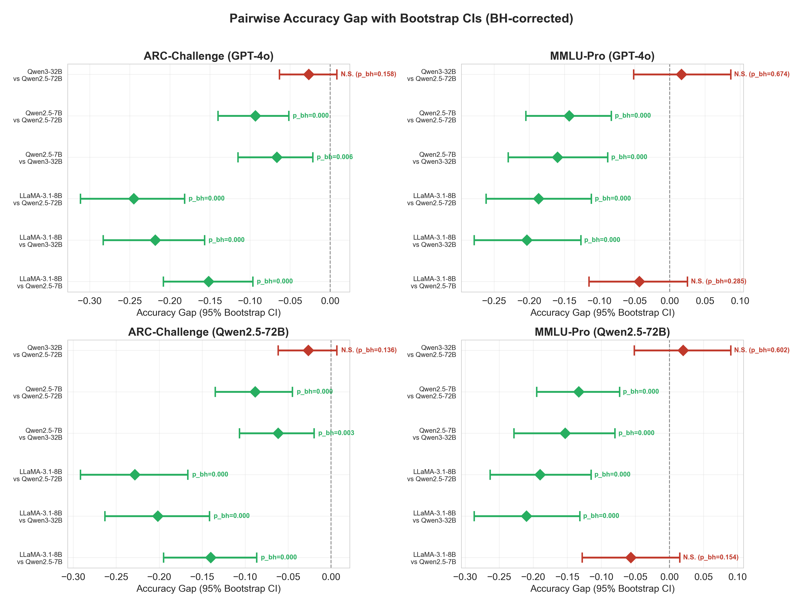
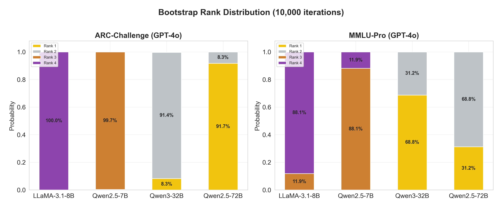
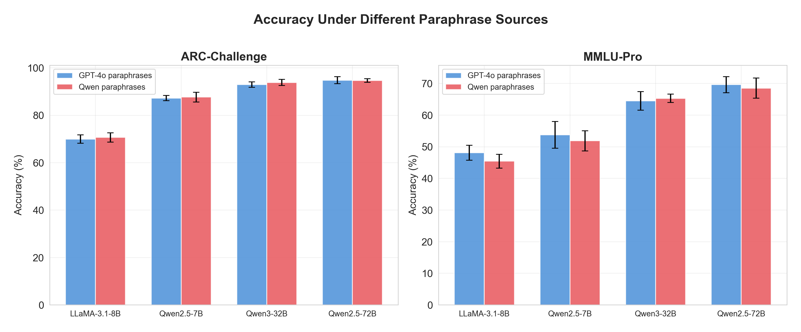
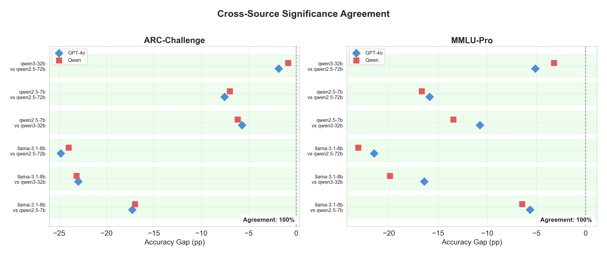
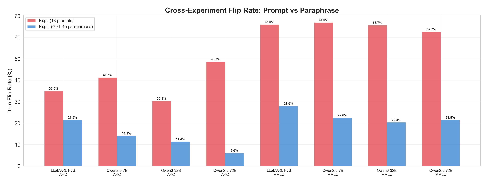
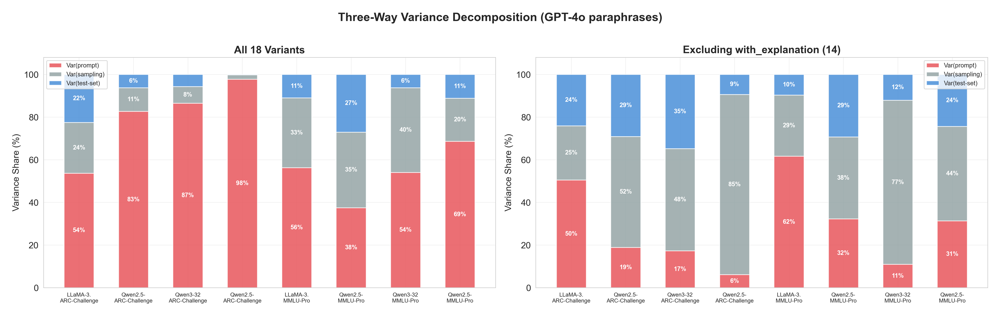

# Experiment II: Test-Set Wording Noise — Paraphrase Sensitivity

## 1. Research Objective

Benchmark scores for large language models (LLMs) are routinely reported as single numbers, yet prior work has shown these scores are sensitive to many extraneous factors. **Experiment I** of this project demonstrated that prompt format is a major source of evaluation noise (up to 33 percentage points of accuracy swing). Experiment II asks the complementary question:

> **How much do LLM benchmark results change when the same question is paraphrased while preserving its semantic meaning?**

Specifically, we aim to:

1. **Quantify test-set wording noise**: measure accuracy variation when questions are semantically equivalent but differently worded.
2. **Assess item-level robustness**: identify what fraction of individual test items "flip" (change correctness) under paraphrasing.
3. **Test cross-source robustness**: verify that findings hold regardless of which model generates the paraphrases (GPT-4o vs. Qwen2.5-72B).
4. **Compare noise sources**: decompose total evaluation variance into prompt noise, test-set wording noise, and sampling noise, establishing their relative magnitudes.

---

## 2. Experimental Design

### 2.1 Overview

| Component | Detail |
|-----------|--------|
| **Benchmarks** | ARC-Challenge (150 questions, 4 options A–D) and MMLU-Pro (150 questions, 10 options A–J) |
| **Models** | LLaMA-3.1-8B-Instruct, Qwen2.5-7B-Instruct, Qwen3-32B, Qwen2.5-72B-Instruct |
| **Versions per question** | 4: v0 (original) + v1, v2, v3 (3 paraphrased variants) |
| **Paraphrase sources** | Dual: GPT-4o (external) + Qwen2.5-72B (internal) |
| **Prompt format** | Fixed base prompt v00 throughout |
| **Temperature** | 0.0 (deterministic) |
| **Total API calls** | 150 Q × 4 versions × 4 models × 2 benchmarks × 2 sources ≈ **9,600** |

### 2.2 Paraphrase Generation

Each of the 300 benchmark questions (150 per dataset) was independently paraphrased by two models:

- **GPT-4o**: An external model not used for evaluation, eliminating potential self-evaluation bias. Prompted at temperature 0.7 to produce 3 diverse paraphrases per question in JSON format.
- **Qwen2.5-72B-Instruct**: An internal model (same family as some evaluation targets), used as a cross-source control. Same protocol as GPT-4o.

**Critical constraint**: Only the question stem is paraphrased. Answer options, option labels, and the correct answer are held constant across all versions. This ensures any observed accuracy change is attributable solely to question wording, not option presentation.

### 2.3 Paraphrase Quality Control

Before running evaluations, all 1,800 paraphrases (300 questions × 3 paraphrases × 2 sources) were validated:

| Validation | GPT-4o | Qwen | Overall |
|------------|--------|------|---------|
| Manual QC (50 random samples) | 100% pass (mean SE=4.96/5) | 100% pass (mean SE=5.00/5) | **100% pass** |
| Bidirectional NLI faithfulness | 95.7% faithful | 97.6% faithful | **96.6% faithful** |
| Contradictions found | 8 / 900 | 3 / 900 | **11 / 1,800 (0.6%)** |
| Paraphrase uniqueness | 100% (all 3 distinct) | 100% (all 3 distinct) | **100%** |
| Mean length change ratio | 16.1% | 15.3% | ~15.7% |

All three paraphrases for every question were confirmed to be semantically distinct from each other (100% uniqueness). The contradiction rate was below 1%, confirming that paraphrases preserve the original meaning with high fidelity.

### 2.4 Answer Parsing Design

Model responses are free-form text. A multi-pattern parser extracts the final answer label through an 8-rule cascade (ordered by specificity):

| Priority | Pattern | Example Match |
|----------|---------|---------------|
| 1 | `Answer: X` / `Answer is X` / `Final answer: X` / `**X**` | "Answer: B" |
| 2 | Leading label `X. …` at start of response | "B. adding salt…" |
| 3 | `X is (the) correct` | "B is the correct answer" |
| 4 | `correct answer/option is X` | "The correct option is B" |
| 5 | `option X` / `choice X` | "option B" |
| 6 | Standalone letter on a line (scan bottom-up) | "B" |
| 7 | Last bold/parenthesized letter | "**(B)**" |
| 8 | First valid letter in very short response (≤ 5 chars) | "B." |

If none of the 8 patterns yields a valid label, the response is marked a **parse failure**.

**Two-stage retry mechanism:**
1. **Phase 1**: Call API with `max_tokens=200` — short limit encourages concise answers.
2. **Phase 2**: For any parse failure, retry with `max_tokens=1024` — gives verbose models room to complete their answer.

**Additional handling:**
- **Qwen3 thinking mode** disabled via `/no_think` suffix to prevent long chain-of-thought that inflates token usage.
- **`<think>…</think>` blocks** stripped from all responses before parsing.

**Parse failure policy (two-layer analysis):**
- **Primary (all 150 Q)**: Parse failures counted as incorrect — reflects real deployment behavior.
- **Supplemental (clean subset)**: Excludes any question with ≥ 1 parse failure across its 4 versions — isolates pure wording noise from format noise.

### 2.5 Example

Below is a concrete example showing how question v0 and its paraphrased variant v1 differ:

**Original (v0):**
> Which action could change the melting point of ice?
> A. heating the water before it is frozen  B. adding salt to the water before it is frozen  C. changing the amount of water to be frozen  D. changing the container for the water to be frozen in
> **Answer: B**

**Paraphrased (v1, GPT-4o):**
> What action has the potential to alter the melting point of ice?
> A. heating the water before it is frozen  B. adding salt to the water before it is frozen  C. changing the amount of water to be frozen  D. changing the container for the water to be frozen in
> **Answer: B** *(unchanged)*

Only the question stem wording changed; options and answer are identical.

---

## 3. Results

### 3.1 Accuracy Stability Across Paraphrased Versions

#### 3.1.1 ARC-Challenge Accuracy

| Model | Mean Acc. | Std Dev | Min | Max | Range |
|-------|-----------|---------|-----|-----|-------|
| LLaMA-3.1-8B | 70.8% | ±2.3% | 68.7% | 74.0% | 5.3 pp |
| Qwen2.5-7B | 86.0% | ±1.4% | 84.0% | 87.3% | 3.3 pp |
| Qwen3-32B | 92.7% | ±1.3% | 90.7% | 93.3% | 2.7 pp |
| Qwen2.5-72B | 95.3% | ±0.5% | 94.7% | 96.0% | 1.3 pp |

*Table: ARC-Challenge accuracy summary across 4 versions (GPT-4o paraphrases). Range = max – min accuracy.*

No parse failures occurred on ARC for any model under either paraphrase source.

#### 3.1.2 MMLU-Pro Accuracy

| Model | Mean Acc. (All 150) | Std Dev | Range | Acc. (Clean 110) | Parse Failures |
|-------|---------------------|---------|-------|-------------------|----------------|
| LLaMA-3.1-8B | 34.8% | ±1.7% | 3.3 pp | 41.1% | 14/600 (2.3%) |
| Qwen2.5-7B | 39.2% | ±2.5% | 5.3 pp | 44.5% | 0/600 (0%) |
| Qwen3-32B | 55.2% | ±1.1% | 2.7 pp | 64.3% | 87/600 (14.5%) |
| Qwen2.5-72B | 53.5% | ±2.1% | 4.0 pp | 63.2% | 0/600 (0%) |

*Table: MMLU-Pro accuracy summary (GPT-4o paraphrases). "All 150" treats parse failures as incorrect; "Clean 110" excludes questions with any parse failure.*

Qwen3-32B suffered the most parse failures (14.5%) on MMLU-Pro because it tends to produce long reasoning chains that exceed the token limit despite the `/no_think` directive. On the clean subset, Qwen3-32B (64.3%) actually slightly outperforms Qwen2.5-72B (63.2%), reversing the full-set ranking.

#### 3.1.3 Accuracy Stability Visualization

*Figure 1. Accuracy across the original question (v0) and three paraphrased versions (v1–v3), for each model and dataset. Top row: GPT-4o paraphrases; bottom row: Qwen paraphrases. Shaded bands indicate the accuracy range. All models maintain consistent ranking across versions, with larger models showing narrower bands (higher robustness).*

**Key observations:**
- ARC accuracy curves are remarkably flat across all 4 versions, with ranges of only 1.3–5.3 pp.
- MMLU shows slightly more variation (2.7–5.3 pp range) but trends remain consistent.
- Both GPT-4o and Qwen paraphrase sources produce nearly identical patterns.
- Model ranking order is preserved across all paraphrased versions on both benchmarks.

---

### 3.2 Item Flip Rate

The **item flip rate** measures what fraction of questions change their correctness status (correct → incorrect or vice versa) across the 4 versions.

#### 3.2.1 Flip Rate Summary

| Model | ARC (GPT-4o) | ARC (Qwen) | MMLU (GPT-4o) | MMLU (Qwen) |
|-------|-------------|------------|---------------|-------------|
| LLaMA-3.1-8B | 33/150 (22.0%) | 30/150 (20.0%) | 39/150 (26.0%) | 35/150 (23.3%) |
| Qwen2.5-7B | 21/150 (14.0%) | 16/150 (10.7%) | 43/150 (28.7%) | 32/150 (21.3%) |
| Qwen3-32B | 16/150 (10.7%) | 14/150 (9.3%) | 48/150 (32.0%) | 41/150 (27.3%) |
| Qwen2.5-72B | 6/150 (4.0%) | 9/150 (6.0%) | 24/150 (16.0%) | 25/150 (16.7%) |

*Table: Item flip rate for each model across both benchmarks and paraphrase sources.*

*Figure 2. Item flip rate per model: fraction of 150 questions whose correctness changes across 4 versions. Solid bars = GPT-4o paraphrases; hatched bars = Qwen paraphrases. Numbers indicate count/total.*

**Key observations:**
- **ARC**: Flip rate inversely correlates with model capability. Qwen2.5-72B flips only 4–6% of items vs. LLaMA-3.1-8B at 20–22% — a roughly 5× gap.
- **MMLU**: Flip rates are substantially higher (16–32%) due to the larger option space (10 vs. 4) and harder content. Notably, Qwen3-32B has the highest MMLU flip rate (32%) despite being the second most accurate model, driven largely by parse failures.
- **Both paraphrase sources** produce consistent flip rate patterns, with GPT-4o typically yielding slightly higher flip rates than Qwen.

---

### 3.3 Parse Failure Analysis

Parse failures represent a systematic noise source that is distinct from wording sensitivity.

| Source | Dataset | LLaMA-8B | Qwen2.5-7B | Qwen3-32B | Qwen2.5-72B |
|--------|---------|----------|------------|-----------|-------------|
| GPT-4o | ARC | 0 (0%) | 0 (0%) | 0 (0%) | 0 (0%) |
| GPT-4o | MMLU | 14 (2.3%) | 0 (0%) | 87 (14.5%) | 0 (0%) |
| Qwen | ARC | 0 (0%) | 0 (0%) | 0 (0%) | 0 (0%) |
| Qwen | MMLU | 14 (2.3%) | 0 (0%) | 80 (13.3%) | 0 (0%) |

*Table: Parse failure counts out of 600 total responses (150 questions × 4 versions) per model-source-dataset combination.*

ARC is clean across the board. MMLU-Pro causes significant parse failures for Qwen3-32B (13–15%) and minor failures for LLaMA-8B (2.3%), both primarily due to models producing verbose explanations that exceed the token limit.

*Figure 3. MMLU-Pro two-layer accuracy: "All 150" (parse failures counted as wrong, blue bars) vs. "Clean" subset (no parse failures, green bars). Red labels show parse failure counts. Qwen3-32B gains nearly 10 percentage points on the clean subset, revealing that parse failures substantially distort its measured accuracy.*

---

### 3.4 Pairwise Model Comparisons

We conduct pairwise significance tests for all $\binom{4}{2} = 6$ model pairs using bootstrap confidence intervals (10,000 resamples) with Benjamini-Hochberg (BH) correction for multiple comparisons.

#### 3.4.1 ARC-Challenge Pairwise Results

| Model Pair | Gap (GPT-4o) | 95% CI | Sig? | Gap (Qwen) | 95% CI | Sig? |
|------------|-------------|--------|------|-----------|--------|------|
| 8B vs. 7B | −15.2 pp | [−20.8, −9.7] | **Yes** (p<.001) | −14.0 pp | [−19.5, −8.7] | **Yes** (p<.001) |
| 8B vs. 32B | −21.8 pp | [−28.3, −15.7] | **Yes** (p<.001) | −20.2 pp | [−26.3, −14.2] | **Yes** (p<.001) |
| 8B vs. 72B | −24.5 pp | [−31.2, −18.2] | **Yes** (p<.001) | −22.8 pp | [−29.2, −16.7] | **Yes** (p<.001) |
| 7B vs. 32B | −6.7 pp | [−11.5, −2.2] | **Yes** (p=.006) | −6.2 pp | [−10.7, −2.0] | **Yes** (p=.003) |
| 7B vs. 72B | −9.3 pp | [−14.0, −5.2] | **Yes** (p<.001) | −8.8 pp | [−13.5, −4.5] | **Yes** (p<.001) |
| 32B vs. 72B | −2.7 pp | [−6.3, +0.8] | **No** (p=.158) | −2.7 pp | [−6.2, +0.7] | **No** (p=.136) |

*Table: Pairwise accuracy gaps on ARC-Challenge, both paraphrase sources. Negative means Model 1 is worse. BH-corrected p-values.*

#### 3.4.2 MMLU-Pro Pairwise Results

| Model Pair | Gap (GPT-4o) | 95% CI | Sig? | Gap (Qwen) | 95% CI | Sig? |
|------------|-------------|--------|------|-----------|--------|------|
| 8B vs. 7B | −4.3 pp | [−11.5, +2.5] | **No** (p=.285) | −5.7 pp | [−12.8, +1.5] | **No** (p=.154) |
| 8B vs. 32B | −20.3 pp | [−27.8, −12.7] | **Yes** (p<.001) | −21.0 pp | [−28.7, −13.2] | **Yes** (p<.001) |
| 8B vs. 72B | −18.7 pp | [−26.2, −11.2] | **Yes** (p<.001) | −19.0 pp | [−26.4, −11.5] | **Yes** (p<.001) |
| 7B vs. 32B | −16.0 pp | [−23.0, −8.8] | **Yes** (p<.001) | −15.3 pp | [−22.8, −8.0] | **Yes** (p<.001) |
| 7B vs. 72B | −14.3 pp | [−20.5, −8.3] | **Yes** (p<.001) | −13.3 pp | [−19.5, −7.3] | **Yes** (p<.001) |
| 32B vs. 72B | +1.7 pp | [−5.2, +8.7] | **No** (p=.674) | +2.0 pp | [−5.2, +9.0] | **No** (p=.602) |

*Table: Pairwise accuracy gaps on MMLU-Pro. 8B vs. 7B and 32B vs. 72B are not statistically significant on either source.*

*Figure 4. Pairwise accuracy gap with 95% bootstrap confidence intervals (BH-corrected). Green diamonds = significant; red diamonds = not significant. Four subplots show ARC and MMLU under both paraphrase sources. The same pairs are (non-)significant across all conditions.*

**Key findings:**
- On ARC, 5 of 6 pairs are significant; only Qwen3-32B vs. Qwen2.5-72B is not.
- On MMLU, 4 of 6 pairs are significant; LLaMA-8B vs. Qwen2.5-7B and Qwen3-32B vs. Qwen2.5-72B are not.
- Models within ~3 pp of each other are consistently non-significant, regardless of paraphrase source.

#### 3.4.3 Ranking Reversals

Across all 4 versions, no ranking reversal occurs on ARC for any model pair under either paraphrase source (0/6 pairs, 0% reversal rate). On MMLU, only one reversal is observed: Qwen3-32B vs. Qwen2.5-72B reverses in 1 of 4 versions under GPT-4o paraphrases (25% reversal rate), consistent with their non-significant accuracy gap.

---

### 3.5 Ranking Stability

We estimate the probability of each model occupying each rank position using 10,000 bootstrap resamples.

#### 3.5.1 ARC-Challenge Rank Distribution (GPT-4o)

| Model | P(Rank 1) | P(Rank 2) | P(Rank 3) | P(Rank 4) | Most Likely |
|-------|-----------|-----------|-----------|-----------|-------------|
| LLaMA-3.1-8B | 0% | 0% | 0% | **100%** | 4th (certain) |
| Qwen2.5-7B | 0% | 0.3% | **99.7%** | 0% | 3rd (certain) |
| Qwen3-32B | 8.3% | **91.4%** | 0.3% | 0% | 2nd (91.4%) |
| Qwen2.5-72B | **91.7%** | 8.3% | 0% | 0% | 1st (91.7%) |

#### 3.5.2 MMLU-Pro Rank Distribution (GPT-4o)

| Model | P(Rank 1) | P(Rank 2) | P(Rank 3) | P(Rank 4) | Most Likely |
|-------|-----------|-----------|-----------|-----------|-------------|
| LLaMA-3.1-8B | 0% | 0% | 11.9% | **88.1%** | 4th (88.1%) |
| Qwen2.5-7B | 0% | 0% | **88.1%** | 11.9% | 3rd (88.1%) |
| Qwen3-32B | **68.8%** | 31.2% | 0% | 0% | 1st (68.8%) |
| Qwen2.5-72B | 31.2% | **68.8%** | 0% | 0% | 2nd (68.8%) |

*Tables: Bootstrap rank probability matrices. Bold = most likely rank.*

*Figure 5. Bootstrap rank distribution (10,000 iterations) for ARC-Challenge and MMLU-Pro (GPT-4o paraphrases). Stacked bar segments represent the probability of each rank position. ARC ranking is nearly deterministic; MMLU shows meaningful uncertainty between Qwen3-32B and Qwen2.5-72B, which swap rank 1–2 with ~31% probability.*

**Key observations:**
- **ARC ranking is highly stable**: LLaMA is 4th with 100% probability; 72B is 1st with 91.7%.
- **MMLU ranking has inherent uncertainty**: 32B and 72B compete for 1st/2nd place. Note that on the full set (PF = wrong), 32B appears to lead; on the clean subset, 72B slightly leads — the ranking depends on how parse failures are handled.
- Bottom two ranks (3rd and 4th) are stable on both benchmarks, with > 88% probability.

---

### 3.6 Cross-Source Robustness

A key design feature is using two independent paraphrase sources. If findings are consistent across sources, they are unlikely to be artifacts of the paraphrase model.

#### 3.6.1 Accuracy Comparison

| Model | ARC (GPT-4o) | ARC (Qwen) | Δ | MMLU (GPT-4o) | MMLU (Qwen) | Δ |
|-------|-------------|------------|---|---------------|-------------|---|
| LLaMA-8B | 70.8% | 72.3% | 1.5 pp | 34.8% | 33.8% | 1.0 pp |
| Qwen-7B | 86.0% | 86.3% | 0.3 pp | 39.2% | 39.5% | 0.3 pp |
| Qwen-32B | 92.7% | 92.5% | 0.2 pp | 55.2% | 54.8% | 0.3 pp |
| Qwen-72B | 95.3% | 95.2% | 0.2 pp | 53.5% | 52.8% | 0.7 pp |

*Table: Mean accuracy under GPT-4o vs. Qwen paraphrases. Maximum difference is 1.5 pp.*

*Figure 6. Accuracy under different paraphrase sources: GPT-4o (blue) vs. Qwen (pink). Error bars show standard deviation across 4 versions. Differences are minimal across all models and benchmarks, confirming source invariance.*

#### 3.6.2 Significance Agreement

*Figure 7. Cross-source significance agreement: GPT-4o (blue diamonds) vs. Qwen (red squares) accuracy gaps for all 6 model pairs. On both ARC and MMLU, all pairs land in the same significance category (both significant or both non-significant) under both sources. Agreement rate = 100%.*

| Dataset | Pairs Agreeing | Agreement Rate |
|---------|----------------|----------------|
| ARC-Challenge | 6 / 6 | **100%** |
| MMLU-Pro | 6 / 6 | **100%** |
| **Overall** | **12 / 12** | **100%** |

**All 12 pairwise significance conclusions are identical under GPT-4o and Qwen paraphrases.** This provides strong evidence that our findings are not artifacts of the particular paraphrase model used.

---

### 3.7 Cross-Experiment Comparison: Prompt Noise vs. Paraphrase Noise

Combining results from Experiment I (18 prompt variants) and Experiment II (4 paraphrased versions) allows direct comparison of the two noise sources.

#### 3.7.1 Flip Rate Comparison

| Model × Dataset | Exp I (18 prompts) | Exp II (4 paras) | Ratio (Exp I / Exp II) |
|-----------------|-------------------|------------------|----------------------|
| LLaMA-8B, ARC | 35.0% | 22.0% | 1.6× |
| Qwen-7B, ARC | 41.3% | 14.0% | 2.9× |
| Qwen-32B, ARC | 30.3% | 10.7% | 2.8× |
| Qwen-72B, ARC | 48.7% | 4.0% | **12.2×** |
| LLaMA-8B, MMLU | 66.0% | 26.0% | 2.5× |
| Qwen-7B, MMLU | 67.0% | 28.7% | 2.3× |
| Qwen-32B, MMLU | 65.7% | 32.0% | 2.1× |
| Qwen-72B, MMLU | 62.7% | 16.0% | 3.9× |

*Table: Item flip rate comparison between Experiment I (prompt perturbation) and Experiment II (paraphrase sensitivity). Prompt noise is consistently 2–12× stronger.*

*Figure 8. Cross-experiment flip rate comparison: Exp I prompt perturbation (red, 18 variants) vs. Exp II paraphrase sensitivity (blue, 4 versions). Every model–dataset combination shows higher flip rates under prompt variation. The gap is largest for Qwen2.5-72B on ARC (12.2× ratio), where prompt changes flip 48.7% of items but paraphrasing flips only 4.0%.*

**Core finding**: Prompt format noise dominates test-set wording noise by a factor of 2–12×. Standardizing prompt format is the single highest-leverage intervention for improving benchmark reliability.

#### 3.7.2 Three-Way Variance Decomposition

We decompose total accuracy variance into three additive components:

$$\text{Var}_{\text{total}} = \text{Var}_{\text{prompt}} + \text{Var}_{\text{sampling}} + \text{Var}_{\text{test-set}}$$

| Model | Dataset | Var(prompt) | Var(sampling) | Var(test-set) |
|-------|---------|-------------|---------------|---------------|
| LLaMA-8B | ARC | 53.7% | 23.8% | 22.5% |
| Qwen-7B | ARC | 82.7% | 11.1% | 6.2% |
| Qwen-32B | ARC | 86.5% | 7.8% | 5.7% |
| Qwen-72B | ARC | **97.8%** | 2.0% | 0.2% |
| LLaMA-8B | MMLU | 56.3% | 32.7% | 11.0% |
| Qwen-7B | MMLU | 37.5% | 35.4% | 27.1% |
| Qwen-32B | MMLU | 54.1% | 39.7% | 6.3% |
| Qwen-72B | MMLU | 68.6% | 20.2% | 11.2% |

*Table: Three-way variance decomposition (all 18 Exp I prompt variants + Exp II GPT-4o paraphrases). Prompt variance dominates in most cases (33–98%), while test-set variance contributes 0.2–27%.*

When the extreme `with_explanation` prompt format is excluded:

| Model | Dataset | Var(prompt) | Var(sampling) | Var(test-set) |
|-------|---------|-------------|---------------|---------------|
| LLaMA-8B | ARC | 50.5% | 25.5% | 24.1% |
| Qwen-7B | ARC | 18.9% | 52.0% | 29.1% |
| Qwen-32B | ARC | 17.3% | 47.9% | 34.8% |
| Qwen-72B | ARC | 6.1% | 84.5% | 9.4% |
| LLaMA-8B | MMLU | 61.7% | 28.7% | 9.7% |
| Qwen-7B | MMLU | 32.3% | 38.4% | 29.3% |
| Qwen-32B | MMLU | 11.0% | 76.9% | 12.1% |
| Qwen-72B | MMLU | 31.4% | 44.2% | 24.4% |

*Table: Variance decomposition excluding the with_explanation prompt. Without the dominant outlier, variance is more balanced, but prompt still leads for most model–dataset pairs.*

*Figure 9. Three-way variance decomposition. Left panel: all 18 prompt variants; right panel: excluding with_explanation. Red = Var(prompt), gray = Var(sampling), blue = Var(test-set). Prompt noise (red) dominates the left panel. In the right panel (outlier removed), the three sources are more balanced, but prompt noise remains the largest contributor for most conditions.*

---

## 4. Summary of Findings

### 4.1 Key Results

| Finding | Evidence |
|---------|----------|
| **Test-set wording noise is small** | Accuracy range < 5.3 pp on ARC, < 5.3 pp on MMLU across all models |
| **Stronger models are more robust** | ARC flip rate: 72B = 4% vs. 8B = 22% (5.5× gap) |
| **MMLU is noisier than ARC** | MMLU flip rate 16–32% vs. ARC 4–22%; 10 options → more ambiguity |
| **Parse failures are a hidden noise source** | Qwen3-32B: 14.5% PF on MMLU; distorts ranking vs. 72B |
| **Cross-source agreement is perfect** | 12/12 significance conclusions identical under GPT-4o vs. Qwen (100%) |
| **Prompt noise >> test-set noise** | Flip rate ratio 2–12×; Var(prompt) = 33–98% vs. Var(test-set) = 0.2–27% |
| **Close models remain hard to distinguish** | 32B vs. 72B: never significant (p > 0.13 on all conditions) |
| **No ranking reversals on ARC** | 0% reversal rate across all 6 pairs, all versions, both sources |

### 4.2 Implications for Benchmark Practice

1. **Prompt standardization matters most.** Of the three noise sources, prompt format contributes the most variance. Benchmarking protocols should specify exact prompt templates.

2. **Paraphrase-based test-set augmentation is valid.** Since test-set wording noise is small and cross-source agreement is 100%, paraphrasing is a reliable method for measuring evaluation robustness without introducing systematic bias.

3. **Parse failures need explicit handling.** Different treatment of parse failures (count as wrong vs. exclude) can flip model rankings (32B vs. 72B on MMLU). Evaluation pipelines should report both approaches.

4. **Single-point accuracy differences < 5 pp should be interpreted with caution.** Our data consistently shows that models within ~3 pp cannot be reliably distinguished even with 150 well-controlled test items.

5. **Benchmark difficulty affects noise.** MMLU-Pro (10 options, harder content) is systematically noisier than ARC-Challenge (4 options, easier content), suggesting that harder benchmarks require larger sample sizes for reliable comparisons.
